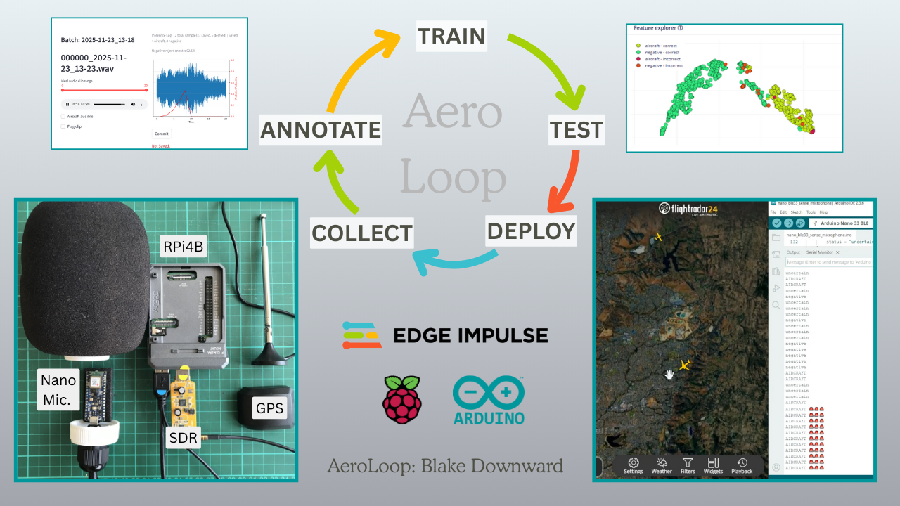
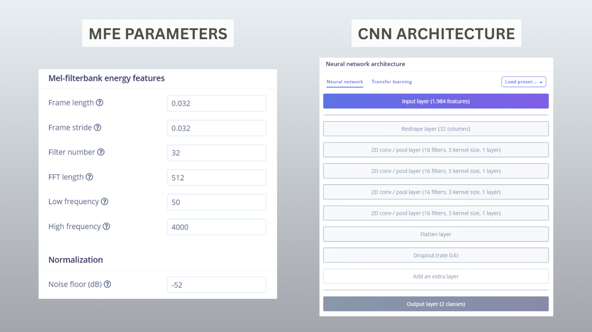
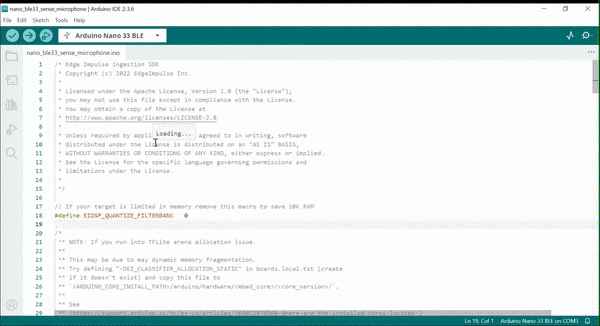
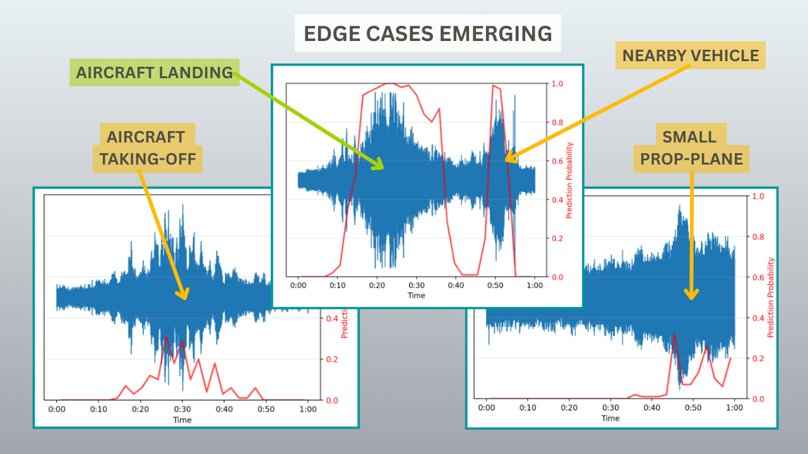
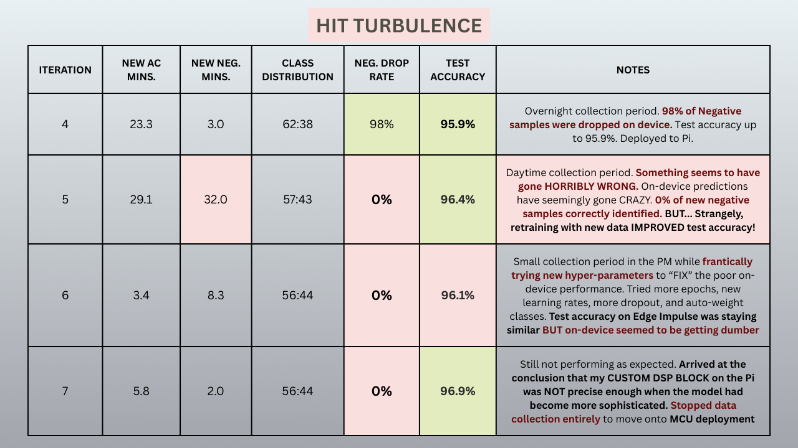
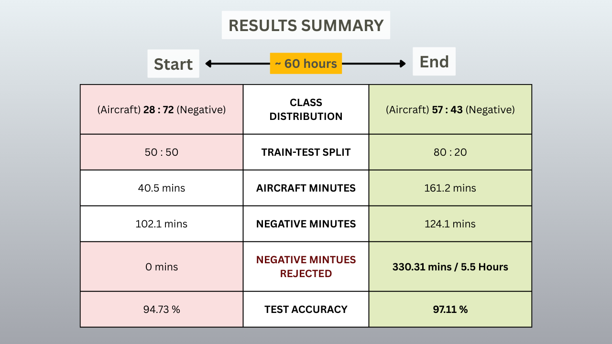
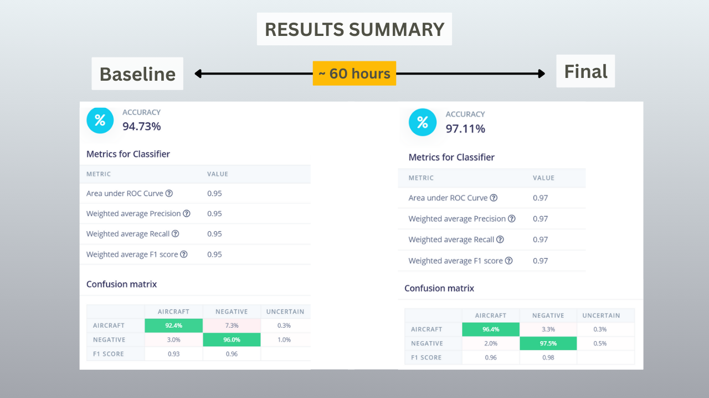
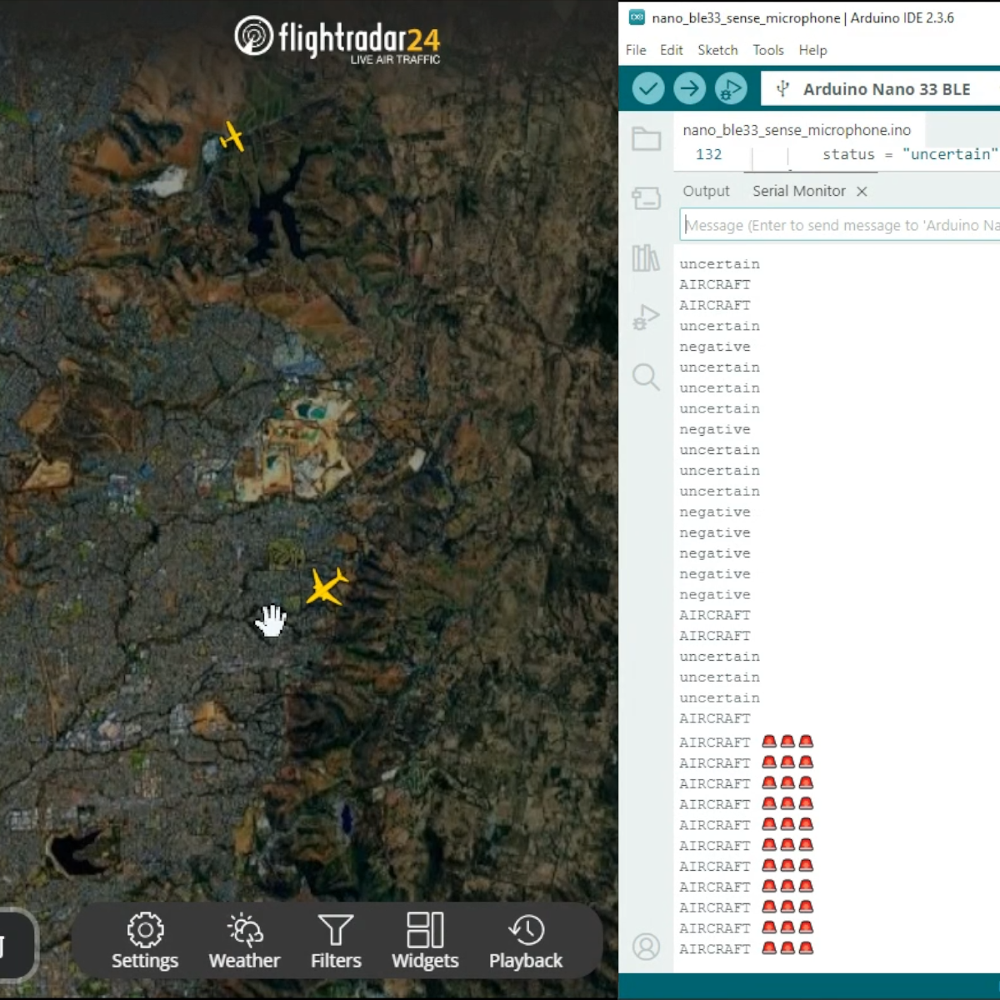
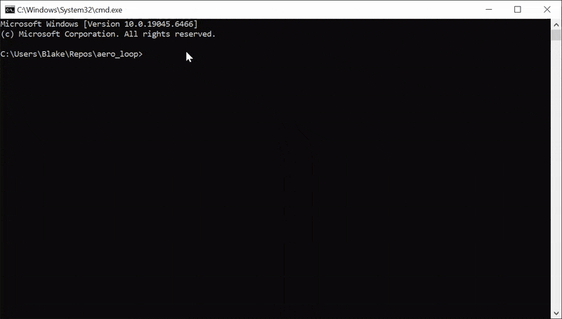
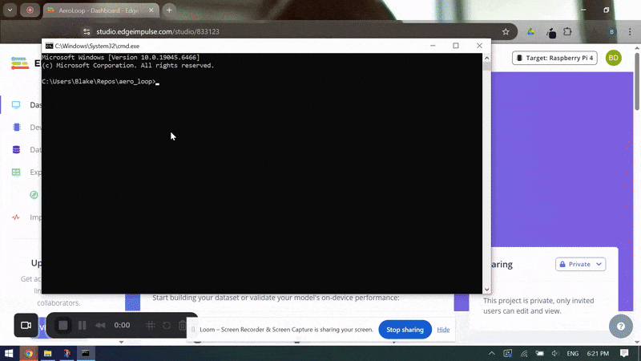

# AeroLoop: Autonomous DataOps for Aircraft Detection at the Edge

**Created By:** Blake Downward  
**Hardware:** Raspberry Pi 4B (4GB), Arduino Nano 33 BLE Sense, Nooelec Mini 2+ SDR, GPS (optional)  
**Edge Impulse Project:** [https://studio.edgeimpulse.com/public/833123/live](https://studio.edgeimpulse.com/public/833123/live)  
**GitHub Repository:** [https://github.com/blakedownward/aero_loop](https://github.com/blakedownward/aero_loop)  
**Baseline Dataset:** [https://zenodo.org/records/17765718](https://zenodo.org/records/17765718)  
**Demo Video:** [https://youtu.be/uabWnYxGiCg?si=wWmoKIV6QwRlf9zX](https://youtu.be/uabWnYxGiCg?si=wWmoKIV6QwRlf9zX)


---

## The Edge Philosophy

> *"The best data pipeline is one that never stores irrelevant data in the first place."*

When I first learned about "big data" and "machine learning", this is the ethos that really **clicked** with me - process data as it arrives, keep what's valuable, throw-out the rest. Simple. Beautiful.

For the Hackathon, I wanted to build something that lived up to this ethos... a system that effectively curates its own dataset to make itself smarter.

This project isn't just about building a model. It's about **building a system that builds models** autonomously, efficiently, and at the edge.

---

## The Problem

**DataOps is ML's Real Bottleneck**

Collecting audio is trivial. A Raspberry Pi can record 24 hours of audio every day without issue. But here's the reality - if you're building an aircraft detection system, maybe **1 hour of that 24 contains aircraft sounds**. The other 23 hours? Background noise; wind, traffic, construction, rain, or just plain pure silence.

### The Annotation Nightmare

Annotating audio is laborious. Each 20-second negative sample takes ~20-30 seconds of human time (listen, verify, label, save). For 23 hours of negatives per day - that's 23 to 34 hours of annotation time per day... clearly not sustainable, but more data is better, right?


### The "Easy Negative" Trap

Most of those 23 hours are **useless** as training data. Silent suburbia at 3 AM doesn't teach your model anything about distinguishing a distant aircraft from a nearby truck. Opportunistic sampling floods your dataset with easy negatives, creating:
- **Class imbalance** (96% negative, 4% aircraft)
- **Wasted training time** (learning patterns that don't generalise)
- **Model naivety** (no exposure to confusing edge cases)

### The Real Challenge

What we really need are **hard negatives** - samples that *sound* like aircraft but aren't. A car accelerating nearby. A lawnmower two houses over. Machinery noises from local roadworks. These are the edge cases that make or break real-world deployment.

**The question:** How do you find hard negatives in 23 hours of random background noise?

---

## The Solution: AeroLoop



AeroLoop is a closed-loop CI/CD pipeline for developing Edge AI that covers three major ML problems simultaneously:

1. **Ground truth labelling** via sensor fusion (Software Defined Radio)
2. **Hard-negative mining** via on-device inference
3. **Autonomous improvement** via remote MLOps

### System Architecture

**Tier 1: The Smart Collector (Raspberry Pi 4 + RTL-SDR)**

The Pi runs two services in parallel:
- **dump1090**: Decodes ADS-B transponder signals from nearby aircraft (no internet required)
- **Collector service**: Monitors aircraft positions and triggers recordings

**Positive class (Aircraft):**
- When an aircraft comes within **3 km** (verified by Haversine distance calculation), trigger a 60-second recording
- Label: `aircraft`
- Ground truth confidence: 99% (still requires human verification)

**Negative class (Background):**
- When no aircraft are within **10 km** for 5+ minutes, opportunistically record 20 seconds of background noise.
- Run inference on the Pi using the **current best model** (TFLite)
- **If all 10 inference windows predict `aircraft < 0.4`:** Delete the sample immediately
- **If any window predicts `aircraft ≥ 0.4`:** Keep the sample for human annotation (the model was confused)

This is **hard-negative mining at the edge**. The system casts a wide net for negatives, but only keeps the ones that challenge the current model.

**Tier 2: The Target Device (Arduino Nano 33 BLE Sense)**

- **256 KB RAM / 1 MB flash** constraint
- Runs optimised model for continuous inference
- Proves the system produces production-ready, ultra-light models


---

## Will our Impulse "fit" on a Microcontroller?

### Device Constraints

The Arduino Nano's 256 KB RAM can theoretically hold ~8 seconds of raw 16 kHz 16-bit audio. But we also need space for:
- DSP features
- Model inference memory (holds the previous 2 predictions)
- System overhead


**Trade-off decisions:**

**Window size: 2 seconds**
- Short enough to fit in memory with DSP overhead
- Long enough to capture temporal aircraft signatures
- Allows <500ms processing time for near-real-time inference

**DSP: MFE (Mel-filterbank Energy)**
- Aggressively reduces dimensions: **32,000 samples → 1,984 features**
- Parameters optimised for dimensionality reduction:
  - 32 mel bands
  - 50 Hz – 4,000 Hz range
  - Frame length: 0.032s, hop: 0.032s
  - On-device estimates: ~276ms processing, ~15 KB peak RAM
  - **Result:** On-device processing: < 150ms





**Model: Compact CNN**
- 4× Conv2D layers for aggressive dimensionality reduction
- Final hidden layer: 128 neurons
- 0.6 dropout for regularisation
- Output: Softmax (2 classes)
- **Result:** On -device inference: < 250ms

**Full pipeline dimensions (2 seconds):**
1. Raw audio: 32,000 samples
2. MFE features: 1,984 (64×31 spectrogram)
3. After Conv2D layers: 128
4. Output: 2 (aircraft, negative)


> Flashing the baseline deployment to the Nano to ensure it runs with DSP and inference parameters.

---

## The Experiment

On November 1st, 2025, I received an email from Edge impulse about the hackathon. I had some SDR monitoring infrastructure working on my Pi, but everything was manually done; physically download files to USB flash drive, annotate on my laptop, then upload to the Edge Impulse Studio.

**My hackathon goal:** Build a truly autonomous system that incorporates AI at the edge. Remote download, smart filtering, automatic retraining, building and deployment... all without touching the Pi in the field.

### Baseline (Iteration 0)

First, I needed to get some initial data for testing purposes, and for training the baseline model that will become our "smart filter". I ran the collector for ~25 hours and manually annotated the entire dataset (a large portion of negative samples collected between 12am and 6am were dropped to try and keep some balance between the classes):
- **142.6 minutes total** (40.5 aircraft, 102.1 negative)
- **~4.5 hours of annotation time**
- Published to Zenodo with commercial open-source licence
- Trained baseline model: **94.73% accuracy**

**Key decision:** 50:50 train/test split (not the typical 80:20). Why? The test set needed to remain **fixed and challenging** to compare future models. Starting with 99.5% accuracy on test would leave no headroom to measure improvement.


Deployed the baseline model to the Pi. Let it run.

**What happened:**

After Iteration 1, I remotely downloaded the files expecting hundreds of negatives. There was only **6.2 minutes** worth. The Pi had deleted 91% on-device. What remained were *all* understandably confusing cases (trucks, cars, construction)... it was working!

I could see that the model was a little naive still...



### Iterations 1-4: Running Smoothly

| Iteration | New Aircraft (mins) | New Negative (mins) | Neg. Drop Rate | Test Accuracy | Result |
|-----------|---------------------|---------------------|----------------|---------------|---------|
| 1 | 32.8 | 6.2 | **91%** | 94.7% | Hard-negative mining working! Class balance shifted to 48:52 |
| 2 | 13.0 | 3.2 | **96%** | **95.3%** | +0.6% gain with minimal new data |
| 3 | 18.2 | 3.3 | **93%** | **95.6%** | Aircraft taking off (new pattern) → model adapts |
| 4 | 23.3 | 3.0 | **98%** | **95.9%** | System hitting stride |

**Human annotation time saved (Iterations 1-4):** Approximately **5 hours** (compared to annotating everything the Pi recorded).


Then something went **horribly wrong**.

### Iterations 5-7: Hit Turbulence

| Iteration | New Aircraft (mins) | New Negative (mins) | Neg. Drop Rate | Test Accuracy | What Went Wrong |
|-----------|---------------------|---------------------|----------------|---------------|-----------------|
| 5 | 29.1 | 32.0 | **0%** | 96.4% | Pi stopped rejecting negatives. Test accuracy *improved* but on-device predictions went haywire |
| 6 | 3.4 | 8.3 | **0%** | 96.1% | Tried hyperparameter tuning (epochs, dropout, class weights). No change on-device |
| 7 | 5.8 | 2.0 | **0%** | 96.9% | Diagnosed the issue |



**What happened?**

I discovered my Pi runs a 32-bit OS - so I couldn't use Edge Impulse's pre-built Linux SDK, and I was unable to use librosa to match the DSP block with Python. So I tried reverse-engineering the MFE DSP block using only NumPy and SciPy. It seemed to work *perfectly*... up to the 5th iteration.

In iteration 3, environmental conditions changed - aircraft started **taking off** instead of landing (different wind direction). The model adapted by learning more sophisticated patterns, but as the model became smarter with new data - the differences in my custom DSP script compared to the Edge Impulse block, led to virtually incomprehensible predictions on-device.

**The proof:** I tested the same audio files:
- **Edge Impulse Studio:** Correctly predicted aircraft/negative with high confidence
- **Pi with custom DSP:** Predictions were incoherent

**The lesson:** When models become sophisticated, **DSP consistency matters**. Production systems need production-grade tooling. A 64-bit Pi would've allowed me to use EI's SDK directly - so this is practically a solved problem with better hardware (card reader/writer to flash the Pi with new OS).

**Resolution:** I stopped the autonomous loop, manually annotated the remaining samples (~60 continuous hours of collection), and trained a final optimised model on the complete dataset.

---

## Results:



### Autonomous Loop Performance (Iterations 1-4)
- **Test accuracy:** 94.73% → 95.9% (+1.17%)
- **Class distribution shift:** 28:72 (aircraft:negative) → 62:38 (more balanced, aircraft-focused)
- **Negative drop rate:** 91-98% (automated filtering working as designed)
- **Human annotation time saved:** ~5.5 hours over 4 iterations



### Final Production Model (Post-Loop)
After manually completing the dataset and training with optimised hyperparameters:
- **Test accuracy:** 97.11%
- **F1 score:** 0.96 (aircraft), 0.98 (negative)
- **Total collection time:** ~60 hours
- **Total dataset:** 161.2 mins aircraft, 124.1 mins negative
- **Total negatives rejected on-device:** 330.31 mins / 5.5 hours

**What this means:** Without hard-negative mining, I would've annotated **454.41 minutes of negatives** (7.5 hours). With AeroLoop, I annotated **124.1 minutes** (2 hours). **Savings: 5.5 hours of annotation time.**

### Real-World Validation

The final model was flashed to the Arduino Nano. I hung it out my window (still connected to my laptop via USB), and opened FlightRadar24 in a browser alongside the Arduino IDE serial monitor.



**What I saw:** The Nano outputs a prediction every 2.4 seconds (approximately). Originally it would simply output "negative" for predictions below 0.4, "uncertain" between 0.4 and 0.6, and "aircraft" when over 0.6. However this was succeptible to jittery outputs. Given the short inference window, it made sense to apply some post-inference smoothing to the predictions - so I used a weighted moving average over the latest 3 predictions to produce a more practical output. The result was a steady stream of predictions that corresponded beautifuly with the plane icons passing over my location.

**The model works.**

---

## Impact & Domain Transferability

### Immediate Applications
- **Airport noise compliance:** Deploy sensor networks around airports; auto-curate data for handling noise complaints
- **Border surveillance:** Detect low-flying smuggling aircraft without radar
- **Aviation safety:** Backup detection for runway incursions or low-visibility conditions

### The Bigger Picture: AeroLoop as a Methodology

Aircraft detection is just the proof. The **system design** generalises to any domain with:
1. **A ground-truth sensor** (SDR, GPS, camera, API)
2. **A target sensor** (microphone, IMU, accelerometer)
3. **Sparse target events** (gunshots, machine faults, rare bird calls)

**Examples:**
- **Gunshot detection:** Use firing range schedules as ground truth; collect audio; filter easy negatives (silence, wind)
- **Predictive maintenance:** Use vibration sensor as ground truth for "fault state"; collect IMU data; filter normal operation
- **Wildlife monitoring:** Use camera for ground truth species ID; collect audio; filter common background calls

The core ethos, **on-device hard-negative mining** - applies anywhere you want to train robust models without drowning in irrelevant data.

---

## How to Reproduce

### Hardware Requirements
- **Collector:** Raspberry Pi 4B (4GB recommended), RTL-SDR (e.g., Nooelec Mini 2+), USB microphone or Arduino Nano flashed as USB mic (see `/sketches/nano_mic/NanoMic.ino`), optional GPS
- **Target:** Arduino Nano 33 BLE Sense (or any EI-supported MCU with PDM mic)

### Software Setup

**1. Clone the repository to local machine**
```bash
git clone https://github.com/blakedownward/aero_loop
cd aero_loop
```

**2. Configure environment**
```bash
cp .env.example .env
# Edit .env with your:
# - EI_API_KEY, EI_PROJECT_ID
# - PI_HOST, PI_USER, PI_SSH_KEY_PATH
```

**3. Set up services** (each has its own venv)
```bash
# Annotator
cd services/annotator && python -m venv venv && venv/Scripts/activate
pip install -r requirements.txt

# Remote (download/deploy)
cd ../remote && python -m venv venv && venv/Scripts/activate
pip install -r requirements.txt

# MLOps (train/upload)
cd ../mlops && python -m venv venv && venv/Scripts/activate
pip install -r requirements.txt
```

**4. Bootstrap with baseline dataset**
- Download from [https://zenodo.org/records/17765718](https://zenodo.org/records/17765718)
- Unzip and upload `aircraft-train`, `aircraft-test`, `negative-train`, `negative-test` folders to your EI project
- Set the Feature Generation and Model parametrers as defined above
- Train the baseline model (94.73% accuracy benchmark)
- Build the C++ package with TFLite compiler in Edge Impulse and download
- Unzip the package and copy the `.tflite` model to the `/models` directory.

**5. Install and deploy the Collector on the Pi**

On your Raspberry Pi:

```bash
# Clone the repository (if not already done)
git clone https://github.com/blakedownward/aero_loop
cd aero_loop/services/collector

# Run the automated installation script
chmod +x install.sh
./install.sh
```

The installation script will:
- Install system dependencies (Python, PortAudio, Git)
- Install Dump1090 (ADS-B decoder)
- Set up Python virtual environment
- Install Python dependencies and TensorFlow Lite Runtime
- Create configuration files from templates
- Set up systemd services to run on boot

After installation, configure the service:

```bash
# Edit .env file with your Pi settings
nano .env
# Set: PI_USERNAME, DEVICE_LATITUDE, DEVICE_LONGITUDE, USE_GPS

# Edit session constants
nano config/session_constants.py
# Configure: Area of Interest, microphone settings, model path, recording parameters
```

Deploy the baseline model to the Pi:

```bash
# Copy the baseline TFLite model to the collector's models directory
# (from your local machine, using SSH or SCP)
scp models/<MODEL_NAME>.tflite pi@<pi-ip>:/home/pi/aero_loop/services/collector/models/
```

Start the services (will start automatically on boot after this initial setup):

```bash
# If using GPS (USE_GPS=true in .env):
sudo systemctl start get_coords
sudo systemctl enable get_coords

# Start dump1090 service (must start before collector)
sudo systemctl start rundump
sudo systemctl enable rundump

# Start main collector service
sudo systemctl start aero-collector
sudo systemctl enable aero-collector

# Verify services are running
sudo systemctl status aero-collector
sudo journalctl -u aero-collector -f
```

**6. Run the AeroLoop workflow (allow time for the collector to gather samples first)**
```bash
# Download new samples from Pi
./run_download.bat
```


```bash
# Annotate (Streamlit UI)
./run_annotator.bat
```



```bash
# Train & deploy (if accuracy improves)
./run_train_deploy.bat
```

[Run Train Deploy: Screen Recording](https://www.loom.com/share/d6a9a72b211548a7b6ccef4f4377bc5e)


The orchestrator automatically:
- Trims audio to annotated ranges
- Uploads to Edge Impulse
- Triggers training
- Evaluates against the fixed test set
- Builds TFLite model (if improved)
- Deploys to Pi (if improved)

**6. Deploy to Arduino Nano**
- In EI Studio: Build → Arduino Library
- Add the library .ZIP to Arduino IDE
- Flash `sketches/nano_inference/aero_loop_nano_ble33_sense_microphone_2sec.ino` via Arduino IDE
- Verify with serial monitor

---

## What Was Built During the Hackathon

To be transparent about project scope:

**Pre-existing (tools/experience/infrastructure):**
- SDR monitoring with dump1090 (open-source software)
- Basic aircraft monitoring (hobbyist script on PC adapted to Pi)
- GPS unit setup on Pi (optional for this project if hardcoding device coordinates)
- General Python/DSP/Streamlit experience

**Built in November 2025 (hackathon contribution):**
- **Remote services:** SSH-based download/upload/deploy scripts.
- **Hard-negative mining logic:** On-device TFLite inference for filtering out easy negatives.
- **Annotation GUI:** Basic Streamlit app with batch processing, range selection, flagging/deletion.
- **MLOps orchestrator:** Automated trim > upload > train > evaluate > build > deploy pipeline.
- **EI API integration:** Automated retraining, model comparison, conditional deployment.
- **Custom DSP pipeline:** NumPy/SciPy reimplementation of the EI MFE block (eventually failed, but proved the need for proper tooling).
- **End-to-end system integration:** Tying all components into a single, cohesive autonomous loop.

**The contribution isn't "I used an SDR" - it's "I built a self-improving ML system that fuses an SDR with on-device inference for autonomous data curation."**

---

## Lessons Learned

### What Worked Brilliantly
1. **Hard-negative mining:** 91-98% drop rates proved the concept... only the confusing samples reach human annotators.
2. **Remote CI/CD:** SSH + EI API allowed truly "hands-free" operation.
3. **Fixed test set:** 50:50 split gave enough headroom to measure incremental improvements - evolved to an 80:20 split by the end of the experiment.
4. **GPU training:** Quick retraining (<10 minutes) meant that newer, better models were deployed back to the Pi as fast as possible. 

### What I'd Do Differently
1. **Use a 64-bit Pi OS:** Would've allowed EI's Linux SDK, avoiding custom DSP issues.
2. **Use a waterproof housing:** Keeping electronics exposed 24/7 is fraught with danger - I was very lucky to not destroy my Nano in the rain.
3. **Implement adaptive thresholding:** 0.4 cutoff worked well, but I suspect will need to lower it as the models get more confident.
4. **Easy positive rejection:** Similarly to easy negatives, perhaps we could also reject easy positive samples on device - saving even more annotation time.
5. **Inline uploads to EI:** Rather than pooling annotations and uploading as a single batch of files (created a bottleneck) - a more efficient approach would be to upload "mini-batches" as they are annotated, clearning the "upload to EI" bottleneck and speeding up the entire "retrain-test-deploy" cycle.

### What Surprised Me
The **class distribution shift** (28:72 → 57:43) happened naturally as the model improved. The baseline dataset was mostly negatives, so it started to *evolve* toward the model's weaknesses. This is exactly what I had hoped would happen, but it happend much quicker than I imagined!


The **"dumb, baseline model"** was MUCH smarter than I expected. In hindsight, I probably could've started with just 30-60 minutes of samples and let the system self-curate from there.

---

## Conclusion: Building Machines That Build Models

Most ML projects follow this pattern:
1. Collect a bunch of data
2. Label everything
3. Train a model
4. Hope it works in production

AeroLoop inverts this:
1. Deploy a model
2. Let it collect only the data it needs to improve
3. Retrain automatically
4. Repeat

This isn't just an aircraft detector. It's a **blueprint for Edge AI DataOps**; a method for building self-improving systems that respect human time, edge constraints, and the messy reality of real-world deployment.

The 5.5 hours of annotation time I saved over 60 hours is a 92% reduction in human labour. Scale that across months, multiple locations, or different domains, and you're looking at the difference between a hobby project and a production system.

**The best data pipeline is one that never stores irrelevant data in the first place.** AeroLoop proves this philosophy works... at the edge, autonomously, and with tiny hardware.

---

**Project Links:**
- GitHub: [https://github.com/blakedownward/aero_loop](https://github.com/blakedownward/aero_loop)
- Edge Impulse Project: [https://studio.edgeimpulse.com/public/833123/live](https://studio.edgeimpulse.com/public/833123/live)
- Baseline Dataset (Zenodo): [https://zenodo.org/records/17765718](https://zenodo.org/records/17765718)
- Demo Video: [https://youtu.be/uabWnYxGiCg?si=wWmoKIV6QwRlf9zX](https://youtu.be/uabWnYxGiCg?si=wWmoKIV6QwRlf9zX)

---

*Built with Edge Impulse, Raspberry Pi, Arduino, and a simple philosophy; collect less, learn more.*