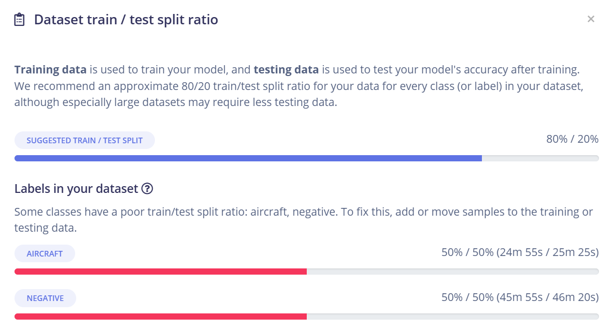
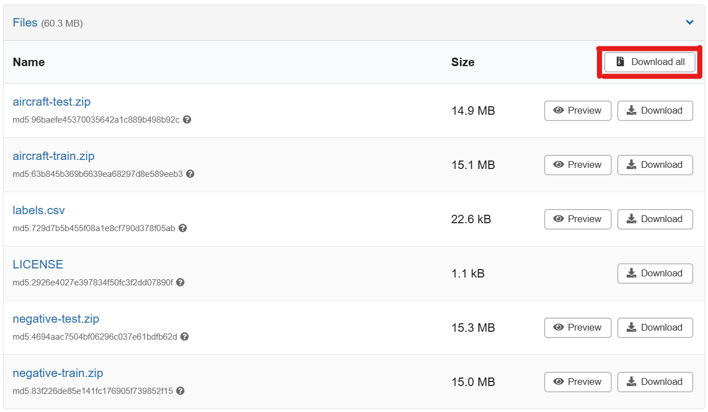
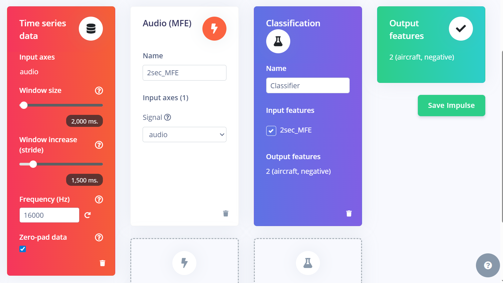
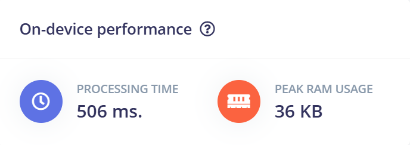
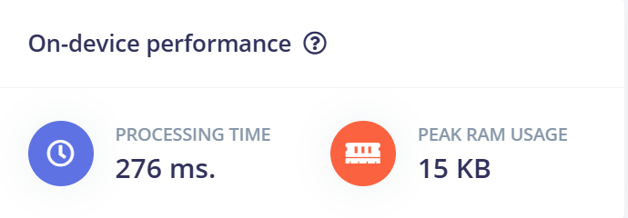
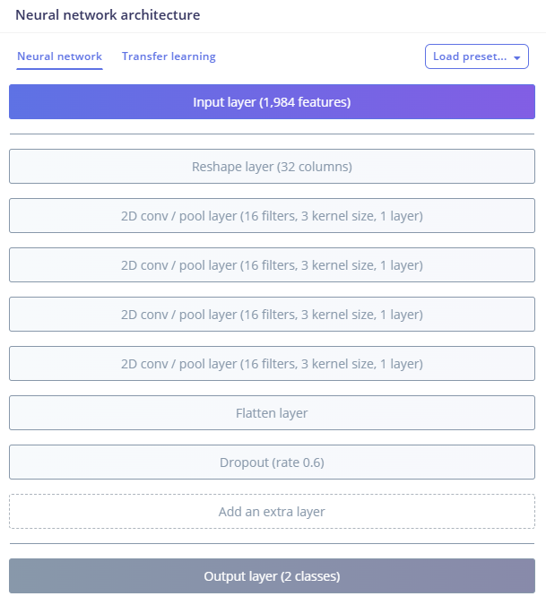

**Aero Loop — Audio Annotation & MLOps Pipeline**

A complete MLOps pipeline for aircraft audio detection, including data collection, annotation, processing, training, and remote deployment to a Raspberry Pi.


## AeroLoop Pipeline Overwiev

The AeroLoop workflow is abstracted to just four high-level services.
1) Collector Service: Deployed to a RaspberryPi 4B with an RTL-SDR and optional GPS unit. Monitors local air traffic to automatically capture and label aircraft and background noise recordings. (See /services/collector/README.md for detailed installation and setup instructions).
2) Download Service: From the repo root, simply run `run_download.bat` (Windows) or `run_download.sh` (Linux) to query the RaspPi for available recordings and download to `/data/raw` on your host machine.
3) Annotator Service: Run `run_annotator.bat` or `run_annotator.sh` to launch the Streamlit annotation GUI. Label files appropriately with event start and end times, or "flag" a sample to avoid it being added to the dataset.
4) Upload, Train & Deploy: Running `run_train_deploy.bat` or `run_train_deploy.sh` will first trim the recordings to the annotated start and end times, then proceed to upload the new samples to the Edge Impulse training dataset. A request is sent to Edge Impulse to `retrain` the model with the updated dataset, then test on the held-out "test set". If the new model improves on the previous best model (accuracy), we send the new model to the RaspPi to assist with "on-device hard negative mining".
**Periodically run steps 2, 3 and 4 until you've reached your desired model performance.**


## Demo Project

AeroLoop itself is an Edge AI project for building Edge AI projects. AeroLoop provides the framework for curating and training aircraft noise models on the Edge Impulse platform. So in order to demonstrate AeroLoop in action, we've attempted to train an aircraft detection model small enough to fit and run on an Arduino Nano Sense microcontroller.

### Target Device
The target device for inference is an Arduino Nano 33 BLE Sense. The Nano was selected primarily because it has a  built-in PDM microphone, but also because that's what I had on-hand. 

Although not strictly necesarry, machine listening models can benefit greatly when training data is collected with the same type of device as the target device. The Arduino Nano Sense is ideal in this situation because it can readily be "flashed" as a USB microphone (used the example USB Mic sketch provided in the Arduino IDE).

### Device Constraints
The constraints of the target device will effectively limit the depth of feature generation (DSP) and model architecture choices. The Arduino Nano has just 256Kb of RAM, and 1MB of Flash memory. Total RAM approximates to just 8 seconds of raw 16KHz 16-bit audio, but we still need to ensure space for running DSP and inference.

The Edge Impulse platform makes it very easy to estimate on-device performance when designing an Impulse. In the EI Studio, it's a good idea to "play-around" with inference window sizes, feature generation parameters, and model architectures to ensure each step "fits" in memory and can be processed in a timely manner.

## Device Stress-Test
Now that we have estimated our pipeline's compute, we should physically verify this on device by training a baseline model with our impulse, then deploy it to the Nano to ensure it runs as expected.

## Baseline Dataset
The AeroLoop Collector service can initially be run with `RUN_INFERENCE=False` to collect the baseline dataset, however, to help others get started ASAP, we uploaded our baseline dataset to Zenodo with a Commercial open-Source license. The dataset was split 50:50 for training and testing - ready for uploading to Edge Impulse.



**Note:** 50:50 Train:Test split is not a common way of splitting data. However, the Test set is critical to monitoring model improvements over time, and should remain a "fixed" set to ensure direct comparison between models. As we are staring with a relatively small dataset, a typical 80:20 split would become disproportionately small as we collect more training data. Additionally, this split will provide more "headroom" to evaluate new models on... eg, if we start with 99.5% accuracy on the test set, then it's probably not representative or "hard-enough" to draw meaningful conclusions from. Starting with 95% accuracy on the other hand does provide enough difficult test cases that even a change from 95% to 95.5% can be considered a significant model improvement.



To get the dataset, go to [Zenodo Link](#) and "Download All" files *(Note: Update with actual Zenodo link)*
Unzip the `aircraft-train`, `aircraft-test`, `negative-train` and `negative-test` folders.
In your Edge Impulse project, go to "Data Acquisition" > "Add Existing Data"
Upload each folder, one by one, ensuring the appropriate "train/test" category and "aircraft/negative" labels are applied.

*Note: Add a screenshot/video of the file upload process when available*

## Baseline Impulse (DSP + Inference)
Since we know the limit of our inference window size is approx 8 seconds, but we still have to allow for DSP and inference compute, so we started by testing a window size of 2 seconds. This should hopefully provide enough temporal information, while also allowing space for running DSP and inference without too much lag.

For Feature Generation/DSP, Edge Impulse recommends the MFE DSP block for audio "state" detection (TODO: verify this) - so we went with that recomendation. Being a "state" detection task, this is essentially a binary classification task, but it's important to remember that EI treats this as a multi-class classifier with soft-max label probabilities. This does not affect our binary classifier, however it DOES provide flexibility to increase the scope of output labels simply by adding new labelled data to the dataset.

Save the impulse, and contiunue to Feature Generation parameter setup.



Edge Impulse initialises with some default DSP parameters. Scrolling to the bottom of this page will display the estimated "On-device performance" for this DSP block on your target device (must ensure your target device is set in EI studio).



The default parameters are estimated to take ~500 ms. and peak RAM of ~36 KB. RAM seems to be within limits, however 500 ms. seems a bit too long to make this feel like real-time inference. By increasing the frame length and stride to 0.032 seconds, we can effectively reduce the number of calculations performed over the entire window. Another way to improve processing time was to aggressively cap the high frequency (from 8KHz to 4KHz), which allows us to acheive similar frequency resolution from a smaller number of Mel filters (less mels == faster processing).

With our new parameters, we have now halved the time and RAM required to process each sample.



### Baseline Model Architecture
It's important to first mention here that the inference window size and DSP parameters will directly impact the number of input dimensions being passed to our model. Without careful management, basic neural networks can easily explode to millions of parameters. When designing an architecture for an edge device, it's important to know exactly what each layer in your model does. Convolutional layers not only learn features, but also have the added benefit of dimensionality reduction and fast computation. Edge Impulse has a default Conv2D architecture with 2 Conv layers to get started with. I opted to further reduce the number of parameters in the final hidden layer by adding another 2 Conv2D layers - reducing the hidden layer to just 128 parameters.



### Full Pipeline
Below we can see how the dimensions change as we reduce the raw audio data to just 2 dimansions (aircrft, negative)

1) 2 Seconds of raw audio: 32,000
2) Feature Extraction: 1,984 (64x32)
3) Convolutional Nerual Net: 2


## Quick Start

The easiest way to run the pipeline is using the provided workflow scripts. Each script automatically activates the appropriate virtual environment and runs the service.

### Download New Samples (Run daily, or twice daily)
```bash
# Windows (PowerShell or Command Prompt)
.\run_download.bat

# Linux/Mac
./run_download.sh
```
Downloads finished audio sessions from Raspberry Pi to `data/raw/`.

### Annotate Samples (Run periodically when batches are available)
```bash
# Windows (PowerShell or Command Prompt)
.\run_annotator.bat

# Linux/Mac
./run_annotator.sh
```
Launches the Streamlit annotation UI to label downloaded audio samples.

### Train & Deploy (Run when enough samples are ready)
```bash
# Windows (PowerShell or Command Prompt)
.\run_train_deploy.bat

# Linux/Mac
./run_train_deploy.sh
```
Runs the complete MLOps workflow:
1. Process annotated files (trim, organize)
2. Upload to Edge Impulse
3. Train model
4. Evaluate model performance
5. Build & download model (if improved)
6. Deploy to Raspberry Pi (if improved)

**Note**: 
- On Windows PowerShell, use `.\` prefix (e.g., `.\run_download.bat`) - PowerShell requires explicit path for security
- On Linux/Mac, you may need to make scripts executable first: `chmod +x run_*.sh`

## Setup

Before running the scripts, ensure each service has its virtual environment set up:

```bash
# Setup Annotator
cd services/annotator
python -m venv venv
venv\Scripts\activate  # Windows
# or: source venv/bin/activate  # Linux/Mac
pip install -r requirements.txt

# Setup Remote
cd services/remote
python -m venv venv
venv\Scripts\activate  # Windows
# or: source venv/bin/activate  # Linux/Mac
pip install -r requirements.txt

# Setup MLOps
cd services/mlops
python -m venv venv
venv\Scripts\activate  # Windows
# or: source venv/bin/activate  # Linux/Mac
pip install -r requirements.txt
```

Also create a `.env` file in the repository root with your configuration (see [Remote Integration Setup](#2-remote-integration-servicesremote) below).

## Components

### 1. Annotator (`services/annotator/`)
- Annotates WAV clips by batch, saving labels to `annotations.json` per batch and marking completion via `.processed`.
- Displays filename, waveform, and an audio player; supports range selection and flags (marking a sample with a Flag will essentially drop the sample from the dataset).

**Quick Start**
- **Recommended**: Use `run_annotator.bat` or `run_annotator.sh` (see Quick Start section above)
- **Manual**: `streamlit run services/annotator/app.py` (after activating venv)

**Data Layout**
- Place audio under `data/raw/<batch_name>/*.wav`.
- App writes `data/raw/<batch_name>/annotations.json`.
- When a batch completes, app creates `data/raw/<batch_name>/.processed` and moves on.

**Usage**
- Use the range slider to set audible start/end (max = clip length; 60s fallback).
- Set "Aircraft audible" and optional "Flag clip" (flag to delete).
- Click "Commit" to save and advance.
- When all batches are done, a "Process Data" button placeholder appears.

**Notes**
- To re-annotate a finished batch, delete its `.processed` file.
- If playback is silent, check system/browser audio settings.

### 2. Remote Integration (`services/remote/`)
- Downloads finished session data from Raspberry Pi
- Deploys trained models to Raspberry Pi

**Setup**

Create a `.env` file in the repository root with your configuration:

```bash
# Copy the example file
cp .env.example .env
# Then edit .env with your settings
```

Required variables:
- **Edge Impulse**: `EI_API_KEY`, `EI_PROJECT_ID`
- **Raspberry Pi**: `PI_HOST`, `PI_USER`, `PI_SESSIONS_PATH`, `PI_MODEL_PATH`
- **SSH Auth**: Either `PI_SSH_KEY_PATH` or `PI_SSH_PASSWORD`

Configuration is done via `.env` file in the repository root.

**Download Sessions**
- **Recommended**: Use `run_download.bat` or `run_download.sh` (see Quick Start section above)
- **Manual**: `python services/remote/download_sessions.py` (after activating venv)

**Deploy Model**
- **Manual**: `python services/remote/deploy_model.py` (after activating venv)
- **Note**: Model deployment is typically handled automatically by the Train & Deploy workflow

### 3. MLOps Pipeline (`services/mlops/`)

**Processor** (`processor.py`)
- Trims annotated WAVs from `data/raw/<batch>` based on `annotations.json`
- Creates trimmed copies in `data/processed/aircraft/` or `data/processed/negative/`
- Run: `python services/mlops/processor.py`

**Edge Impulse Integration**
- **Uploader** (`ei_uploader.py`): Uploads processed samples to Edge Impulse
  - Requires: `EI_API_KEY` and `EI_PROJECT_ID` in `.env` file
  - Run: `python services/mlops/ei_uploader.py`
  
- **Trainer** (`ei_trainer.py`): Triggers training runs on Edge Impulse
  - Run: `python services/mlops/ei_trainer.py` (start training)
  - Run: `python services/mlops/ei_trainer.py status` (check status)
  
- **Downloader** (`ei_downloader.py`): Downloads trained models from Edge Impulse
  - Run: `python services/mlops/ei_downloader.py`
  
- **Model Evaluator** (`model_evaluator.py`): Compares model performance
  - Automatically called during workflow

**Orchestrator** (`orchestrator.py`)
- Orchestrates the complete MLOps workflow:
  1. Process annotated files (trim, etc.)
  2. Upload to Edge Impulse
  3. Train model
  4. Evaluate model performance
  5. Build & download model (if improved)
  6. Deploy improved models to Pi

**Usage**
- **Recommended**: Use `run_train_deploy.bat` or `run_train_deploy.sh` (see Quick Start section above)
- **Manual**: 
  ```bash
  # Run complete train & deploy workflow
  python services/mlops/orchestrator.py --steps process_annotations upload_to_ei train_model evaluate_model build_and_download deploy_model --wait-training
  
  # Run specific steps
  python services/mlops/orchestrator.py --steps process_annotations upload_to_ei
  
  # Wait for training to complete
  python services/mlops/orchestrator.py --wait-training
  ```

## Complete Workflow

The typical workflow follows three main phases:

1. **Data Collection**: Raspberry Pi continuously collects audio samples in batched sessions (typically less than one hour). When attached to a network, the collector service can run 24/7 without physical intervention or stopping recording. When a recording session is completed, it is marked with a `.processed` file to indicate samples are ready to be downloaded in the next step.

2. **Download** (Run daily, or twice daily):
   ```bash
   .\run_download.bat  # Windows (PowerShell/CMD)
   # or
   ./run_download.sh   # Linux/Mac
   ```
   Fetches finished sessions from Pi to `data/raw/`

3. **Annotation** (Run periodically when new batches are available):
   ```bash
   .\run_annotator.bat  # Windows (PowerShell/CMD)
   # or
   ./run_annotator.sh   # Linux/Mac
   ```
   Label downloaded audio samples using the Streamlit UI

4. **Train & Deploy** (Run when enough annotated samples are ready):
   ```bash
   .\run_train_deploy.bat  # Windows (PowerShell/CMD)
   # or
   ./run_train_deploy.sh   # Linux/Mac
   ```
   Automates the complete MLOps pipeline:
   - Process annotated files (trim, organize)
   - Upload to Edge Impulse
   - Train model
   - Evaluate model performance
   - Build & download model (if improved)
   - Deploy to Raspberry Pi (if improved)

**Note**: The Train & Deploy workflow automatically skips build/download and deployment if the model doesn't improve.

## Session Detection Logic

The system uses multiple methods to detect finished sessions:
1. **Primary**: Check if a newer session exists (indicates previous session is complete)
2. **Secondary**: Check for `.processed` marker file in session directory
3. **Fallback**: Time-based heuristics (sessions older than 6 hours with no recent activity)

## Model Evaluation

Models are evaluated based on:
- **Primary**: Test set accuracy
- **Secondary**: Loss (lower is better)
- **Tertiary**: F1 score

A model is only deployed if it improves on at least one metric.
