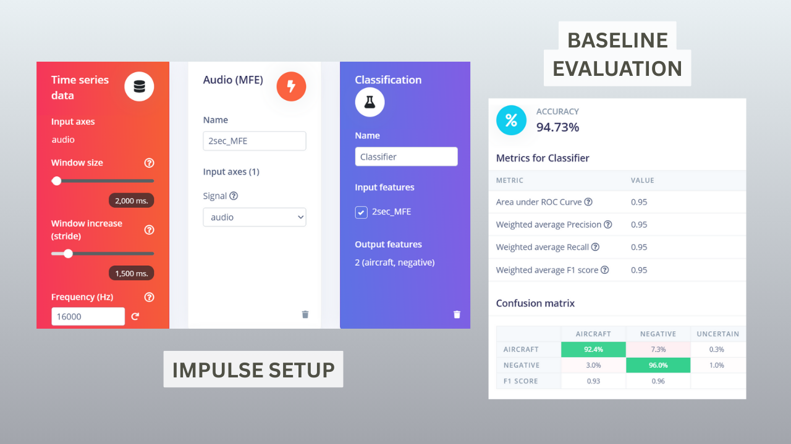
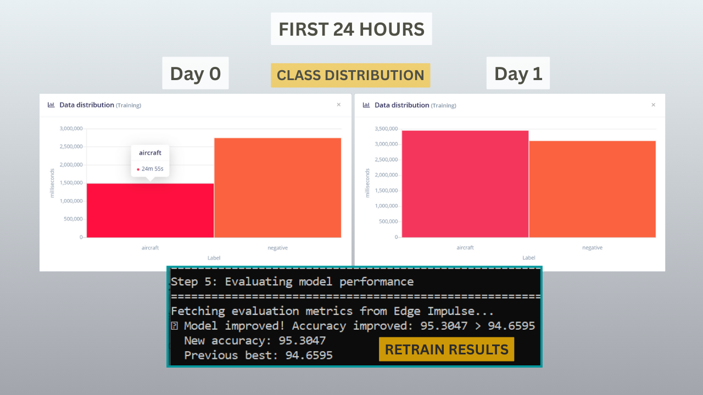

AeroLoop: Autonomous Edge Data Curation & Aircraft Detection
Created By: Blake Downward
Hardware: Raspberry Pi 4B (4GB), Arduino Nano 33 BLE Sense, Nooelec Mini 2+ SDR, GPS (optional)

1. The Elevator Pitch
Collecting data is easy. Collecting valuable data is hard.
In real-world Edge AI, "lab" data rarely matches "field" conditions. Environmental sounds like wind, traffic, and construction vary by location and confuse models. Collecting 24 hours of audio a day creates a bottleneck: humans cannot annotate that much data, and 99% of it is useless silence or easy negatives.
AeroLoop is a closed-loop DataOps system that solves this. It uses a Raspberry Pi with a Software Defined Radio (SDR) to capture "Ground Truth" aircraft events, and uses the current edge model to filter out "easy" background noise. This leaves us with a highly curated dataset of "hard negatives"—the confusing edge cases that actually improve model performance—dramatically reducing human annotation time while increasing accuracy.
2. The Problem: The Data Bottleneck
I wanted to deploy an Aircraft Detection model to an Arduino Nano 33 BLE Sense (256KB RAM). I faced three specific challenges:
Sparsity: Aircraft events are rare. Recording 24/7 fills storage with empty noise.
The "Easy Negative" Trap: Randomly sampling background noise usually results in "easy" samples (silence). These don't help the model learn the difference between a distant plane and a nearby truck.
Device Constraints: The Arduino Nano requires a tiny, efficient model. It cannot afford to be confused by wind or cars.
3. The Solution: AeroLoop
AeroLoop is a remote CI/CD pipeline for the Edge. It consists of two hardware tiers:
Tier 1: The "Smart" Collector (Raspberry Pi 4 + RTL-SDR)
The Pi acts as the field manager. It runs a Python service that monitors nearby aircraft via ADS-B radio signals (using dump1090).
Positive Samples: When a plane is physically within 3km (verified by radio physics), the Pi triggers a recording. Result: Auto-labeled Positive data.
Hard Negative Mining: When no planes are near, the Pi records opportunistically. Crucially, it runs the current iteration of the TFLite model on the audio.
If the model correctly identifies "Background Noise" (high confidence) -> Delete Sample. (We don't need more easy data).
If the model wrongly thinks it is a "Plane" -> Keep Sample. (This is a "Hard Negative" that confused the model).
Tier 2: The Target (Arduino Nano 33 BLE Sense)
The optimized model is deployed here. Because the dataset is curated to focus on difficult edge cases, we can achieve high robustness with a smaller model architecture, fitting comfortably within the 256KB RAM limit.

> [Action: Insert a flowchart. SDR/Mic -> Pi Filter -> Upload to EI -> Train -> Deploy -> Back to Pi]
4. Technical Implementation
Hardware Stack
Collector: Raspberry Pi 4B, Nooelec RTL-SDR v5, USB GPS (optional).
Target: Arduino Nano 33 BLE Sense (flashed with Edge Impulse firmware).
Power: Solar-charged 12V battery system for remote deployment.
DSP & Model Architecture (The Constraints)
To run on the Arduino Nano, I had to be aggressive with resource management.
Window: 2 seconds (Sweet spot between memory usage and capturing temporal features).
DSP: MFE (Mel-filterbank Energy). Aggressively compressed from 32,000 raw samples to 1,984 features.
Model: A custom CNN pipeline designed for compression.
4x Conv2D layers (Used for dimensionality reduction).
Reduced the final hidden layer to just 128 neurons.
Result: The model fits in RAM with room to spare for the DSP buffer.

> [Action: Insert screenshot of the Impulse Design from Edge Impulse Studio]
The MLOps Pipeline
I built a custom Python suite (/services/mlops) that automates the loop:
Download: Fetches curated clips from the Pi.
Annotator: A Streamlit app for rapid human verification (only needed for the "confusing" clips).
Train & Deploy: A script that trims audio, uploads to Edge Impulse, triggers training, evaluates against the Test Set, and—if accuracy improves—auto-deploys the new model back to the Raspberry Pi.
5. Results: The 48-Hour Experiment
To prove the system works, I ran AeroLoop for 2 days. The goal: Does "Hard Negative Mining" actually improve the model faster than random sampling?
The Baseline: A "dumb" model trained on 2 hours of generic audio. Accuracy: 94.7%.
Iteration	New Data Added	Focus	Model Accuracy	Result
Iter 1	+39 mins	Pi filters "Easy" noise	94.7%	Triage system deployed.
Iter 2	+16 mins	Hard Negatives Only	95.3%	+0.6% gain with minimal data.
Iter 3	+21 mins	High Altitude/Takeoffs	95.6%	Model learned to distinguish wind.
Iter 4	+26 mins	Hard Mining Continued	95.9%	Robustness achieved.
Key Finding: By Iteration 2, the Pi was deleting ~96% of negative recordings automatically. I only had to annotate the 4% that were actually confusing (construction noise, heavy wind). This saved hours of human work.

> [Action: Side-by-side screenshot of the Baseline Confusion Matrix vs. Final Model Confusion Matrix]
6. Demonstration
Here is the system in action. You can see the Arduino Nano reacting to the aircraft sound, and the Raspberry Pi terminal showing the "Hard Negative" filter logic running in real-time.
> [Action: Embed your Loom or YouTube video link here. "Watch the Demo Video"]
7. How to Reproduce
The entire pipeline is open source.
Hardware: Flash your Nano with the provided USB Mic sketch. Set up a Pi with dump1090.
Software: Clone the repo.
code
Bash
# Run the continuous loop
./run_download.sh
./run_annotator.sh
./run_train_deploy.sh
Data: The baseline dataset is available on Zenodo to kickstart your own loop.
8. Future Impact
AeroLoop proves that Edge AI isn't just about inference; it's about curation. This architecture can be applied to:
Bio-acoustics: Detecting rare bird calls while ignoring common forest noise.
Industrial: Detecting specific machine faults while ignoring standard factory hum.
Security: Detecting glass breaks while ignoring street traffic.
By moving the curation to the edge, we build smarter models, faster.